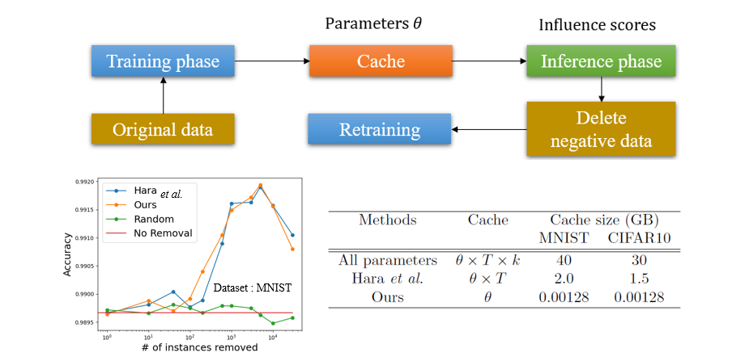

# SGD-Influence

This is the code for data cleansing : Data Cleansing for Deep Neural Networks with Storage-efficient Approximation of Influence Functions.

> [**Data Cleansing for Deep Neural Networks with Storage-efficient Approximation of Influence Functions**]((https://arxiv.org/abs/2103.11807).),
> Kenji Suzuki, Yoshiyuki Kobayashi, Takuya Narihira
> *arXiv technical report ([arXiv 2103.11807]( https://arxiv.org/abs/2103.11807))*            



## Abstract 
Identifying the influence of training data for data cleansing can improve the accuracy of deep learning. An approach with stochastic gradient descent (SGD) called SGD-influence to calculate the influence scores was proposed, but, the calculation costs are expensive. It is necessary to temporally store the parameters of the model during training phase for inference phase to calculate influence sores. In close connection with the previous method, we propose a method to reduce cache files to store the parameters in training phase for calculating inference score. We only adopt the final parameters in last epoch for influence functions calculation. In our experiments on classification, the cache size of training using MNIST dataset with our approach is 1.236 MB. On the other hand, the previous method used cache size of 1.932 GB in last epoch. It means that cache size has been reduced to 1/1,563. We also observed the accuracy improvement by data cleansing with removal of negatively influential data using our approach as well as the previous method. Moreover, our *simple* and *general* proposed method to calculate influence scores is available on our auto ML tool without programing, Neural Network Console. The source code is also available.

## Citation
@misc{suzuki2021data,
      title={Data Cleansing for Deep Neural Networks with Storage-efficient Approximation of Influence Functions}, 
      author={Kenji Suzuki and Yoshiyuki Kobayashi and Takuya Narihira},
      year={2021},
      eprint={2103.11807},
      archivePrefix={arXiv},
      primaryClass={cs.LG}
}

## Installation of Neural Network Libraries
Please follow the installation guide of the Neural Network Libraries on https://nnabla.org/install/

## Installation of related packages
Please install some related packages using the following command:

```
pip install -r requirements.txt
```

## How to Run
All processes are executed with the following example command.

```
python eval_sgd_influence.py -o output_sgd_influence -ds cifar10 -nt 1
```

 | option | input parameters | items |
 |--------|------------------|-------|
 | -o  | {user setting}   | output folder |
 | -ds |  cifar10, mnist, stl10 | dataset|
 | -nt  |  {number(int)}  | number of trials   |

There are other options. The detailed infomation for each option is described in eval_sgd_influence.py
This consists of the processes below. 

### Training
In training phase (sgd_influence/train.py), the order of the instances used in each epoch and batch is recorded for influence calculation while saving parameters.
A conventional CNN model with six convolution layers is used in this example.

### SGD-Influence Calculation
In influence calculation phase (sgd_influence/infl.py), the effect of each instance in training is calculated with the saved information in training.
The parameter of every loop in each epoch is used for the original algorithm ([1] Hara *et al.*), while only the last weight is used to calculate approximate influence in modified method (Ours).

The influence csv files are saved under the folders in nnabla-examples/responsible_ai/data_cleansing/output_sgd_influence/influence.
The names of the folders correspond to influence calculation methods.

### Evaluation
Retraining is executed in almost the same way as in training phase to evaluate the result.
In evaluation phase (sgd_influence/eval.py), the worst n instances of influence are removed while training the model.
This is repeated assigning different values for n, which enables to evaluate the effect of particular instances on model accuracy.
Random skip is also evaluated as control.

The results csv files of retraining score are saved under the folders in nnabla-examples/responsible_ai/data_cleansing/output_sgd_influence/score.
The names of the folders correspond to influence calculation methods.

### Visualize the Results
In visualization phase (sgd_influence/analyze.py), results of the retraining are summarized and visualized.
This helps you to understand the effect of influence in data cleansing.

The result files in the previous section are summarized and saved under nnabla-examples/responsible_ai/data_cleansing/output_sgd_influence/summary.
This is used to visualize result, which is saved in nnabla-examples/responsible_ai/data_cleansing/output_influence_functions_/fig

## Reference
[1] Satoshi Hara, Atsushi Nitanda, and Takanori Maehara. Data cleansing for models trained with SGD. In [*Advances in  Neural Information Processing Systems*, pages 4215-4224, 2019.](https://proceedings.neurips.cc/paper/2019/hash/5f14615696649541a025d3d0f8e0447f-Abstract.html)

</br>

# Influence Functions

This is the code for data cleansing by  Understanding Black-box Predictions via Influence Functions

> [**Understanding Black-box Predictions via Influence Functions**]((https://arxiv.org/abs/1703.04730).),
> Pang Wei Koh, Percy Liang.
>*arXiv technical report ([arXiv 1703.04730]( https://arxiv.org/abs/1703.04730))* 

## How to Run
The installation of Neural Network Libraries and related packages are written above in the SGD-nfluence. All processes are executed with the following example command:

```
python eval_influence_functions.py -o output_influence_functions -ds cifar10 -nt 1
```

 | option | input parameters | items |
 |--------|------------------|-------|
 | -o  | {user setting}   | output folder |
 | -ds |  cifar10, mnist, stl10 | dataset|
 | -nt  |  {number(int)}  | number of trials   |

There are other options. The detailed infomation for each option is described in eval_influence_functions.py

This code consists of the processes that are traning, influence calculation, evaluation, and visualization of the results as well as the SGD-influence.
The results are saved in nnabla-examples/responsible_ai/data_cleansing/output_influence_functions. Refer to the SGD-influence section for the detailed information of the output directory structure.
